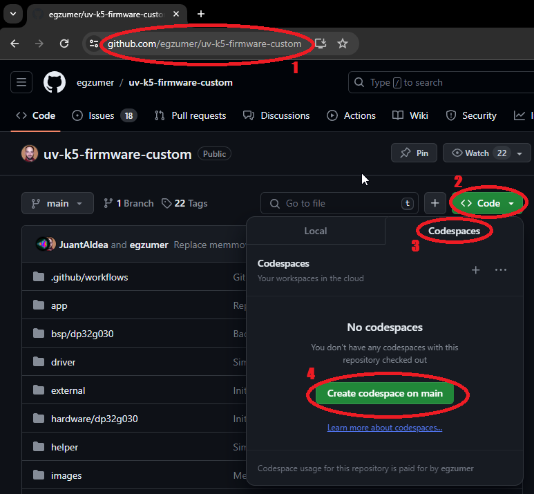
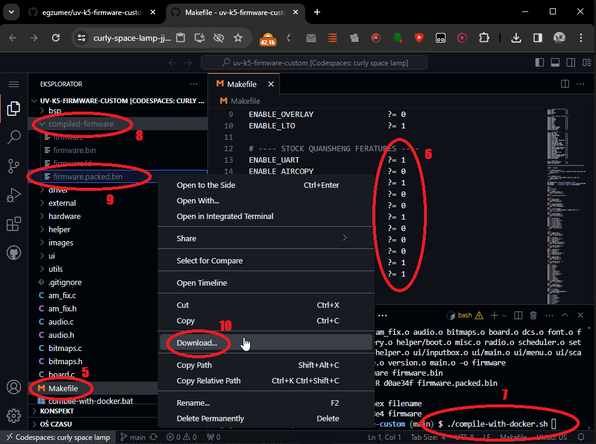

# Stats


# Open re-implementation of the Quansheng UV-K5/K6/5R v2.1.27 firmware

This repository is a fork of [Egzumer custom firmware](https://github.com/egzumer/uv-k5-firmware-custom), who was a merge of [OneOfEleven custom firmware](https://github.com/OneOfEleven/uv-k5-firmware-custom) with [fagci spectrum analizer](https://github.com/fagci/uv-k5-firmware-fagci-mod/tree/refactor) plus my few changes.

All is a cloned and customized version of DualTachyon's open firmware found [here](https://github.com/DualTachyon/uv-k5-firmware) ... a cool achievement !

> [!NOTE]
> EN - About Chirp, as many others firmwares, you need to use a dedicated driver available on [this repository](https://github.com/armel/uv-k5-chirp-driver). 
>
> _FR - A propos de Chirp, comme beaucoup d'autres firmwares, vous devez utiliser un pilote dédié disponible sur [ce dépôt](https://github.com/armel/uv-k5-chirp-driver)._

> [!WARNING]
> EN - THIS FIRMWARE HAS NO REAL BRAIN. PLEASE USE YOUR OWN. Use this firmware at your own risk (entirely). There is absolutely no guarantee that it will work in any way shape or form on your radio(s), it may even brick your radio(s), in which case, you'd need to buy another radio.
Anyway, have fun.
>
> _FR - CE FIRMWARE N'A PAS DE VÉRITABLE CERVEAU. VEUILLEZ UTILISER LE VÔTRE. Utilisez ce firmware à vos risques et périls. Il n'y a absolument aucune garantie qu'il fonctionnera d'une manière ou d'une autre sur votre (vos) radio(s), il peut même bousiller votre (vos) radio(s), dans ce cas, vous devrez acheter une autre radio. Quoi qu'il en soit, amusez-vous bien._

> [!CAUTION]
> EN - I recommend to backup your eeprom with [k5prog](https://github.com/sq5bpf/k5prog) before playing with alternative firmwares. It's a good reflex to have. 
>
> _FR - Je recommande de sauvegarder votre eeprom avec [k5prog](https://github.com/sq5bpf/k5prog) avant de jouer avec des firmwares alternatifs. C'est un bon réflexe à avoir._

## 日本語・受信専用版（v4.3J / JP-RX-Only）

このディレクトリのUV-K5向けビルドは、**日本語表示と受信専用運用**を目的にした版です。表示名は`Kris v4.3J`、エディション名は`JP-RX-Only`です。

- 送信処理と送信系メニューを無効化しています。PTTは送信開始ではなく、モニター機能に割り当てています。
- FM放送受信は日本向けに`76.0–95.0 MHz`へ固定しています。
- 日本語フォントは[uv-k5-jp](https://github.com/rainy-knight/uv-k5-jp)のフォントデータを参考にしています。表示幅の制約により、一部のメニュー名は`LCDCtr`、`SMeter`、`Sleep`などの短い表記を残しています。
- 受信専用版では送信機能がないため、送信出力・PTTモード・TOT・送信CTCSS/DCSなどの設定は通常メニューから除外しています。

### 基本操作

上流版の操作体系は[armel版Wiki](https://github.com/armel/uv-k5-firmware-custom/wiki)に準拠しています。主な操作は次のとおりです。

| 操作 | 動作 |
| --- | --- |
| `M`短押し | メニューを開く |
| `UP` / `DOWN` | メニュー項目・周波数・設定値を移動 |
| `M` | 項目を確定 |
| `EXIT` | キャンセル、または現在の画面を終了 |
| `F` + `2 A/B` | 上側／下側VFOを選択 |
| `F` + `3 VFO/MR` | 周波数モード／メモリーチャンネルモードを切替 |
| `PTT` | モニターを切替（送信しない） |
| `F` + `0 FM` | FM放送受信を開く |
| `* SCAN`長押し | 周波数またはメモリーチャンネルをスキャン |

メニュー番号を数字キーで入力すると、目的の項目へ直接移動できます。設定画面では`UP`／`DOWN`で値を選び、`M`で確定、`EXIT`で取り消します。詳しいボタン割り当ては[Button functions](https://github.com/armel/uv-k5-firmware-custom/wiki/Button-functions)、メニューの一覧は[Menu](https://github.com/armel/uv-k5-firmware-custom/wiki/Menu)、周波数・チャンネル操作は[Radio operation](https://github.com/armel/uv-k5-firmware-custom/wiki/Radio-operation)を参照してください。

### 日本語メニューの読み方

| 表示 | 意味 |
| --- | --- |
| `ステップ` | 周波数の刻み幅 |
| `受信DCS` / `受信CTCS` | 受信時のDCS／CTCSSトーン設定 |
| `変調` | FM・AM・USBなどの受信方式 |
| `CH追加1`～`CH追加3` | 現在のチャンネルをスキャンリストへ追加 |
| `CH保存` / `CH削除` / `CH名` | メモリーチャンネルの保存・削除・名前変更 |
| `Sリスト` | 使用するスキャンリストの選択 |
| `F1短押` / `F1長押`、`F2短押` / `F2長押` | サイドボタンの短押し／長押し機能 |
| `キーロック` | 自動キーロックの待ち時間 |
| `電圧%表示` | ステータスバーの電圧・電池残量表示 |
| `CH表示` | 周波数・チャンネル番号・名前の表示形式 |
| `ON画面` | 電源投入時の表示内容 |
| `BLTime` / `BLMin` / `BLMax` | バックライトの点灯時間・最小輝度・最大輝度 |
| `キー音` | キー操作音 |
| `SysInf` | ファームウェア版、電池電圧・残量の情報 |
| `受信モード` | MAIN ONLYまたはDUAL RXの受信動作 |
| `スケルチ` | 無信号時に音声を抑えるレベル |
| `LCDCtr` / `LCDInv` | LCDコントラスト・表示反転 |
| `SMeter` / `SetGUI` | Sメーター形式・画面レイアウト |
| `Sleep` / `SetNFM` | 無操作時のスリープ・狭帯域FM幅 |

長音記号（`ー`）は、大小どちらのフォントでも表示できるASCIIの`-`としてメニュー文字列に格納しています。これにより、`キーロック`や`キー音`を大きい文字で表示したときも空白になりません。

### ビルドと書き込み

ARM GNUツールチェーン（`arm-none-eabi-gcc`）とPythonが必要です。まずホスト側の回帰チェックを実行します。

```text
make test
```

ファームウェアを作成する場合は次を実行します。

```text
make
```

通常は`f4hwn.packed.bin`を使用します。書き込み前にEEPROMをバックアップし、書き込み手順は[Flashing the firmware](https://github.com/armel/uv-k5-firmware-custom/wiki/Flashing-the-firmware)を確認してください。機種差や書き込み環境による失敗を避けるため、対象機種に対応したファイルだけを使用してください。

# Donations

Special thanks to Jean-Cyrille F6IWW (2 times), Fabrice 14RC123, David F4BPP, Olivier 14RC206, Frédéric F4ESO, Stéphane F5LGW, Jorge Ornelas (4 times), Laurent F4AXK, Christophe Morel, Clayton W0LED, Pierre Antoine F6FWB, Jean-Claude 14FRS3306, Thierry F4GVO, Eric F1NOU, PricelessToolkit, Ady M6NYJ, Tom McGovern (4 times), Joseph Roth, Pierre-Yves Colin, Frank DJ7FG, Marcel Testaz, Brian Frobisher, Yannick F4JFO, Paolo Bussola, Dirk DL8DF, Levente Szőke (2 times), Bernard-Michel Herrera, Jérôme Saintespes, Paul Davies, RS (3 times), Johan F4WAT, Robert Wörle, Rafael Sundorf, Paul Harker, Peter Fintl, Pascal F4ICR (2 times), Mike DL2MF, Eric KI1C (2 times), Phil G0ELM, Jérôme Lambert, Meinhard Frank Günther, Eliot Vedel, Alfonso EA7KDF, Jean-François F1EVM, Robert DC1RDB, Ian KE2CHJ, Daryl VK3AWA, Roberto Brunelli, Robert Boardman, Stephen Oliver, Nicolas F4INE and William Bruno for their [donations](https://www.paypal.com/paypalme/F4HWN). That’s so kind of them. Thanks so much 🙏🏻

## Table of Contents

* [My Features](#main-features)
* [Main Features from Egzumer](#main-features-from-egzumer)
* [Manual](#manual)
* [Radio Performance](#radio-performance)
* [Compiler](#compiler)
* [Building](#building)
* [Credits](#credits)
* [Other sources of information](#other-sources-of-information)
* [License](#license)
* [Example changes/updates](#example-changesupdates)

## Main features and improvements from F4HWN:

* several firmware versions:
    * Bandscope (with spectrum analyzer made by Fagci),
    * Broadcast (with commercial FM radio support),
    * Basic (with spectrum analyzer and commercial FM radios support, but without certain functions such as Vox, Aircopy, etc.),
    * RescueOps (specifically designed for first responders: firefighters, sea rescue, mountain rescue),
    * Game (with a small breakout game),
* improve default power settings level: 
    * Low1 to Low5 (<~20mW, ~125mW, ~250mW, ~500mW, ~1W), 
    * Mid ~2W, 
    * High ~5W,
    * User (see SetPwr),
* improve S-Meter (IARU Region 1 Technical Recommendation R.1 for VHF/UHF - [read more](https://hamwaves.com/decibel/en/)),
   * S-Meter (S0/S9) Level EEPROM settings that were introduced in the Egzumer firmware are now ignored and replaced by hardcoded values to comply with the IARU Recommendation.     
* improve bandscope (Spectrum Analyser):
    * add channel name,
    * add save of some spectrum parameters,
* improve UI: 
    * menu index is always visible, even if a menu is selected,
    * s-meter new design (Classic or Tiny), 
    * MAIN ONLY screen mode, 
    * DUAL and CROSS screen mode, 
    * RX blink on VFO RX, 
    * RX LED blink, 
    * Squelch level and Monitor,
    * Step value,
    * CTCSS or DCS value,
    * KeyLock message,
    * last RX,
    * move BatTxt menu from 34/63 to 30/63 (just after BatSave menu 29/63),
    * rename BackLt to BLTime,
    * rename BltTRX to BLTxRx,
    * improve memory channel input,
    * improve keyboard frequency input,
    * add percent and gauge to Air Copy,
    * improve audio bar,
    * and more...
* new menu entries and changes:
    * add SetPwr menu to set User power (<20mW, 125mW, 250mW, 500mW, 1W, 2W or 5W),
    * add SetPTT menu to set PTT mode (Classic or OnePush),
    * add SetTOT menu to set TOT alert (Off, Sound, Visual, All),
    * add SetCtr menu to set contrast (0 to 15),
    * add SetInv menu to set screen in invert mode (Off or On),
    * add SetEOT menu to set EOT (End Of Transmission) alert (Off, Sound, Visual, All),
    * add SetMet menu to set s-meter style (Classic or Tiny),
    * add SetLck menu to set what is locked (Keys or Keys + PTT),
    * add SetGUI menu to set font size on the VFO baseline (Classic or Tiny),
    * add TXLock menu to open TX on channel,
    * add SetTmr menu to set RX and TX timers (Off or On),
    * add SetOff menu to set the delay before the transceiver goes into deep sleep (Off or 1 minute to 2 hours),
    * add SetNFM menu to set Narrow width (12.5kHz or 6.25kHz),
    * rename BatVol menu (52/63) to SysInf, which displays the firmware version in addition to the battery status,
    * improve PonMsg menu,
    * improve BackLt menu,
    * improve TxTOut menu,
    * improve ScnRev menu (CARRIER from 250ms to 20s, STOP, TIMEOUT from 5s to 2m)
    * improve KeyLck menu (OFF, delay from 15s to 10m)
    * add HAM CA F Lock band (for Canadian zone),
    * add PMR 446 F Lock band,
    * add FRS/GMRS/MURS F Lock band,
    * remove blink and SOS functionality, 
    * remove AM Fix menu (AM Fix is ENABLED by default),
    * add support of 3500mAh battery,
* improve status bar:
    * add SetPtt mode in status bar,
    * change font and bitmaps,
    * move USB icon to left of battery information,
    * add RX and TX timers,
* improve lists and scan lists options:
    * add new list 3,
    * add new list 0 (channel without list...),
    * add new scan lists options,
        * scan list 0 (all channels without list),
        * scan list 1,
        * scan list 2,
        * scan list 3,
        * scan lists [1, 2, 3],
        * scan all (all channels with or without list),
    * add scan list shortcuts,
* add resume mode on startup (scan, bandscope and broadcast FM),
* new actions:
    * RX MODE,
    * MAIN ONLY,
    * PTT, 
    * WIDE NARROW,
    * 1750Hz,
    * MUTE,
    * POWER HIGH (RescueOps),
    * REMOVE OFFSET (RescueOps),
* new key combinations:
    * add the F + UP or F + DOWN key combination to dynamically change the Squelch level,
    * add the F + F1 or F + F2 key combination to dynamically change the Step,
    * add F + 8 to quickly switch backlight between BLMin and BLMax on demand (this bypass BackLt strategy),
    * add F + 9 to return to BackLt strategy,
    * add long press on MENU, in * SCAN mode, to temporarily exclude a memory channel,
    * add short press on [0, 1, 2, 3, 4 or 5], in * SCAN mode, to dynamically change scan list.
* many fix:
    * squelch, 
    * s-meter,
    * DTMF overlaying, 
    * scan list 2 ignored, 
    * scan range limit,
    * clean display on startup,
    * no more PWM noise,
    * and more...
* enabled AIR COPY
* disabled ENABLE_DTMF_CALLING,
* disabled SCRAMBLER,
* remove 200Tx, 350Tx and 500Tx,
* unlock TX on all bands needs only to be repeat 3 times,
* code refactoring and many memory optimization,
* displays the live screen of the Quansheng K5 on your computer via a USB-to-Serial cable,
* and more...

## Main features from Egzumer:
* many of OneOfEleven mods:
   * AM fix, huge improvement in reception quality
   * long press buttons functions replicating F+ action
   * fast scanning
   * channel name editing in the menu
   * channel name + frequency display option
   * shortcut for scan-list assignment (long press `5 NOAA`)
   * scan-list toggle (long press `* Scan` while scanning)
   * configurable button function selectable from menu
   * battery percentage/voltage on status bar, selectable from menu
   * longer backlight times
   * mic bar
   * RSSI s-meter
   * more frequency steps
   * squelch more sensitive
* fagci spectrum analyzer (**F+5** to turn on)
* some other mods introduced by me:
   * SSB demodulation (adopted from fagci)
   * backlight dimming
   * battery voltage calibration from menu
   * better battery percentage calculation, selectable for 1600mAh or 2200mAh
   * more configurable button functions
   * long press MENU as another configurable button
   * better DCS/CTCSS scanning in the menu (`* SCAN` while in RX DCS/CTCSS menu item)
   * Piotr022 style s-meter
   * restore initial freq/channel when scanning stopped with EXIT, remember last found transmission with MENU button
   * reordered and renamed menu entries
   * LCD interference crash fix
   * many others...

 ## Manual

Up to date manual is available in the [Wiki section](https://github.com/armel/uv-k5-firmware-custom/wiki)

## Radio performance

Please note that the Quansheng UV-Kx radios are not professional quality transceivers, their
performance is strictly limited. The RX front end has no track-tuned band pass filtering
at all, and so are wide band/wide open to any and all signals over a large frequency range.

Using the radio in high intensity RF environments will most likely make reception anything but
easy (AM mode will suffer far more than FM ever will), the receiver simply doesn't have a
great dynamic range, which results in distorted AM audio with stronger RX'ed signals.
There is nothing more anyone can do in firmware/software to improve that, once the RX gain
adjustment I do (AM fix) reaches the hardwares limit, your AM RX audio will be all but
non-existent (just like Quansheng's firmware).
On the other hand, FM RX audio will/should be fine.

But, they are nice toys for the price, fun to play with.

## Compiler

arm-none-eabi GCC version 10.3.1 is recommended, which is the current version on Ubuntu 22.04.03 LTS.
Other versions may generate a flash file that is too big.
You can get an appropriate version from: https://developer.arm.com/downloads/-/gnu-rm

clang may be used but isn't fully supported. Resulting binaries may also be bigger.
You can get it from: https://releases.llvm.org/download.html

## Building

### Github Codespace build method

This is the least demanding option as you don't have to install enything on your computer. All you need is Github account.

1. Go to https://github.com/armel/uv-k5-firmware-custom
1. Click green `Code` button
1. Change tab from `Local` to `Codespace`
1. Click green `Create codespace on main` button



5. Open `Makefile`, edit build options and save changes
1. If necessary, open `compile-with-docker.sh`, edit build versions and save changes
1. Run in terminal window
    - `./compile-with-docker.sh bandscope` to compile bandscope version
    - `./compile-with-docker.sh broadcast` to compile broadcast version
    - `./compile-with-docker.sh voxless` to compile voxless version
    - `./compile-with-docker.sh all` to compile all versions 
    - `./compile-with-docker.sh custom` to compile only with Makefile build options   
1. Open folder `compiled-firmware`
1. Right click `firmware.packed.bin`
1. Click `Download`, now you should have a firmware on your computer that you can proceed to flash on your radio. You can use [online flasher](https://egzumer.github.io/uvtools)



### Docker build method

If you have docker installed you can use [compile-with-docker.bat](./compile-with-docker.bat) (Windows) or [compile-with-docker.sh](./compile-with-docker.sh) (Linux/Mac), the output files are created in `compiled-firmware` folder. This method gives significantly smaller binaries, I've seen differences up to 1kb, so it can fit more functionalities this way. The challenge can be (or not) installing docker itself. 

> [!TIP]
> On Linux/Mac, you may need to uncomment and customize the DOCKER_NETWORK environment variable at the beginning of the [compile-with-docker.sh](./compile-with-docker.sh) script. Note: this can introduce security risks by removing network isolation. However, if you encounter issues and are using a specific network environment (with a proxy or a firewall), this may help.

### Windows environment build method

1. Open windows command line and run:
    ```
    winget install -e -h git.git Python.Python.3.8 GnuWin32.Make
    winget install -e -h Arm.GnuArmEmbeddedToolchain -v "10 2021.10"
    ```
2. Close command line, open a new one and run:
    ```
    pip install --user --upgrade pip
    pip install crcmod
    mkdir c:\projects & cd /D c:/projects
    git clone https://github.com/armel/uv-k5-firmware-custom.git
    ```
3. From now on you can build the firmware by going to `c:\projects\uv-k5-firmware-custom` and running `win_make.bat` or by running a command line:
    ```
    cd /D c:\projects\uv-k5-firmware-custom
    win_make.bat
    ```
4. To reset the repository and pull new changes run (!!! it will delete all your changes !!!):
    ```
    cd /D c:\projects\uv-k5-firmware-custom
    git reset --hard & git clean -fd & git pull
    ```

I've left some notes in the win_make.bat file to maybe help with stuff.

## Credits

Many thanks to various people:

* [Egzumer](https://github.com/egzumer)
* [OneOfEleven](https://github.com/OneOfEleven)
* [DualTachyon](https://github.com/DualTachyon)
* [Mikhail](https://github.com/fagci)
* [Andrej](https://github.com/Tunas1337)
* [Manuel](https://github.com/manujedi)
* @wagner
* @Lohtse Shar
* [@Matoz](https://github.com/spm81)
* @Davide
* @Ismo OH2FTG
* [OneOfEleven](https://github.com/OneOfEleven)
* @d1ced95
* and others I forget

## Other sources of information

[ludwich66 - Quansheng UV-K5 Wiki](https://github.com/ludwich66/Quansheng_UV-K5_Wiki/wiki)<br>
[amnemonic - tools and sources of information](https://github.com/amnemonic/Quansheng_UV-K5_Firmware)

## License

Copyright 2023 Dual Tachyon
https://github.com/DualTachyon

Licensed under the Apache License, Version 2.0 (the "License");
you may not use this file except in compliance with the License.
You may obtain a copy of the License at

    http://www.apache.org/licenses/LICENSE-2.0

    Unless required by applicable law or agreed to in writing, software
    distributed under the License is distributed on an "AS IS" BASIS,
    WITHOUT WARRANTIES OR CONDITIONS OF ANY KIND, either express or implied.
    See the License for the specific language governing permissions and
    limitations under the License.

## Example changes/updates

Here are a few photos.

||
|:--:|
| Main Only and Dual RX Respond |


||
|:--:|
| Main Only and Dual RX Respond (invert mode) |


||
|:--:|
| Some new menu entries |


||
|:--:|
| Main Only and Spectrum Analyzer |
